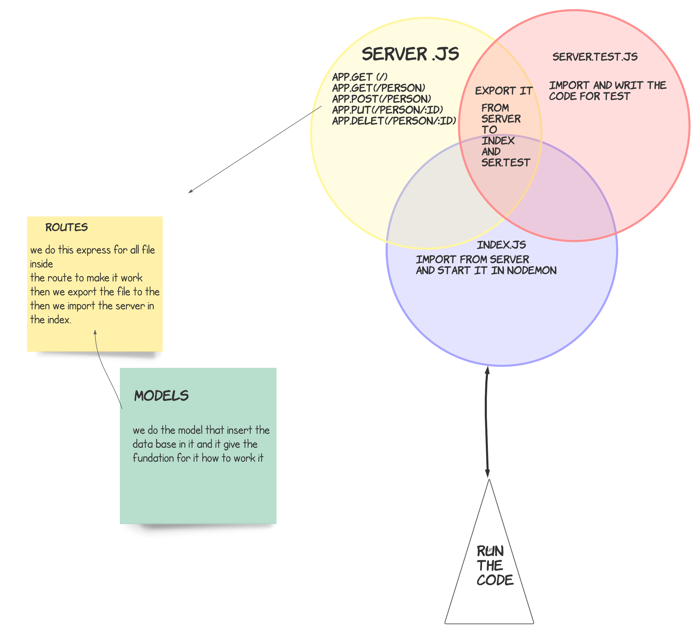

# basic-api-server

## notes 

1. we learn about SQL
2. download 
    >"pg": "^8.7.1",
    >"sequelize": "^6.6.5",
    >"sequelize-cli": "^6.2.0",
    >"sqlite3
3. new command for data base 
4. Install The Postgres Database Server 
5.  

## deployment links

- qusai-basic-api-server --> [repo]()
- PR --> [pull requist]()
- repo action -->[action]()
- heruko --> [heruko]()

## MUL

